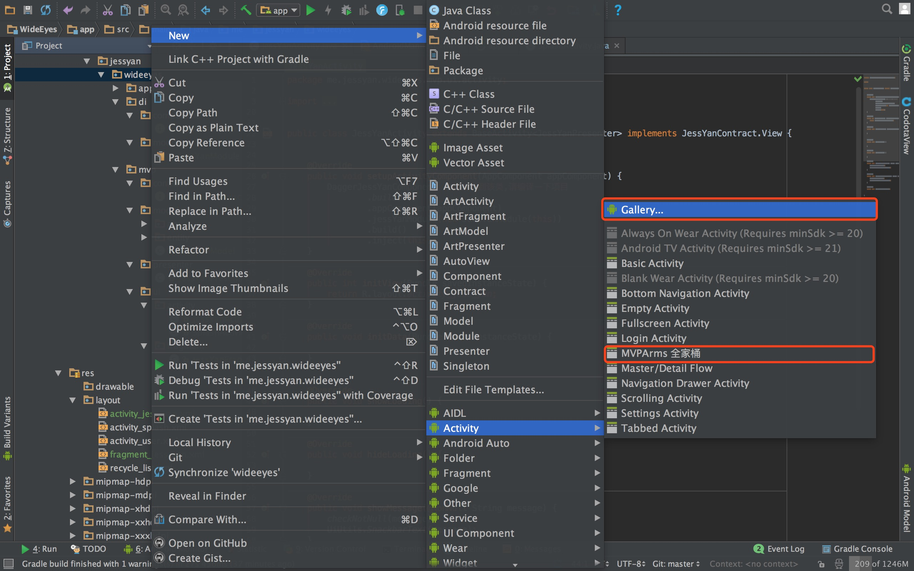
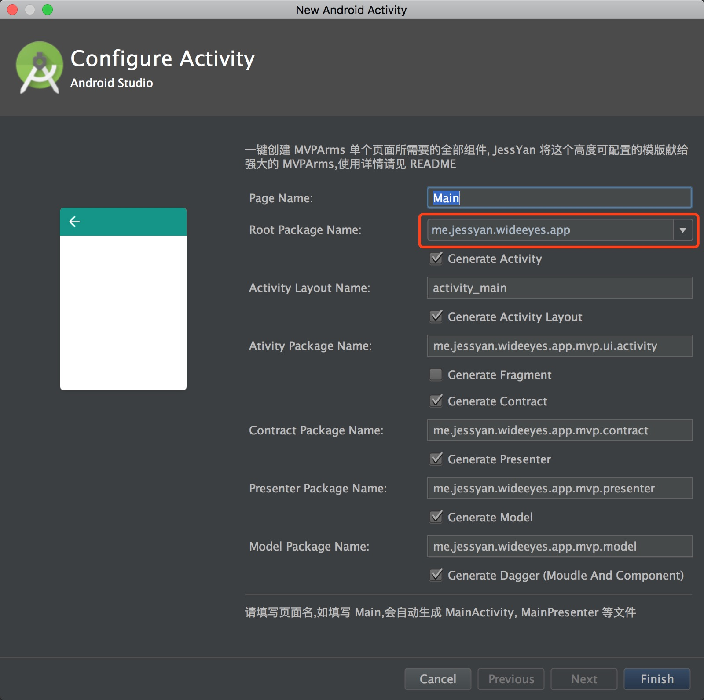

# MVPArmsTemplate
A template for Android Studio to create [MVPArms](https://github.com/JessYanCoding/MVPArms) Page 

**MVPArmsTemplate** 是 [**JessYan**](https://github.com/JessYanCoding) 为强大的 [**MVPArms**](https://github.com/JessYanCoding/MVPArms) 打造的一款高度可配置且炒鸡炫酷的插件式模版,拥有一键自动生成 **File** **Xml**,以及可自定义配置文件名,布局名,和用于文件生成的目标包路径,并且每一个组建都有权利选择生成或者不生成

# 如何安装？

请将 **MVPArmsTemplate** 这个文件夹复制到 **AndroidStudio Activity** 模版的存放路径,请注意是复制整个文件夹,不是里面的内容!

**AndroidStudio Activity** 模版存放路径:

* Windows : AS安装目录/plugins/android/lib/templates/activities

* Mac : /Applications/Android Studio.app/Contents/plugins/android/lib/templates/activities

# 如何使用?

一图胜千言,两个红色的标记都可以点,至于快捷键自己百度, **Mac** 是 **Command + n**

# 注意事项

* 原则上在任何包下都可以点击上面的按钮生成文件,你在哪个包下点击生成文件, **Root Package Name** 的值就是哪个包,下面的 **Activity Package Name** , **Presenter Package Name** 的默认值(根据 **MVPArms Demo** 的包结构)都是根据这个 **Root Package Name** 联动的,以我 **MVPArms Demo** 的包结构, **Presenter** 是放在 **.mvp.presenter** 下的,现在 **Presenter Package Name** 的值显示的确是 **.app.mvp.presenter**,所以你最好在你的根包名下点击生成文件(如me.jessyan.wideeyes),当然这些输出包名都是可以修改,你不一定要使用我的默认的输出包名,因为每个人的包结构都不一样,所以包名可配置是刚需       

* 生成 **Activity** 以及 **Fragment** 前,必须填写 **Layout Name**,你可以自行生成布局后,再将布局名填写到 **Activity/Fragment Layout Name**,也可以使用本模版自动生成布局,自动生成布局请将 **Generate Activity/Fragment Layout** 勾选上(默认勾选),如果你已经自行生成了布局,不想使用自动生成布局,那请不要勾选(一定要注意,因为这个是默认勾选的)

